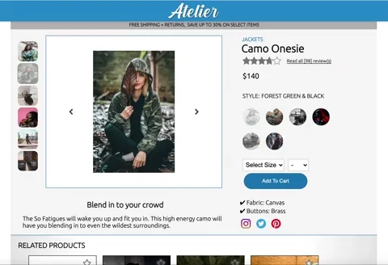

# atelier-front-end

# Project Overview
A client-facing retail web-portal has become significantly outdated and it has been hurting sales numbers. The task is to redesign the site and refresh its features.

[Scope](#scope) |
[Module Detail](#module-detail) |
[Technologies](#technologies) |
[Getting Started](#getting-started)

# Scope
The main focus of this project will encompass the product detail page which will be comprimised of four different modules.

### **Team Granite's Front-End Capstone Members**

|Overview Detail | Related Products | Questions & Answers | Ratings & Reviews |
| ------------- | ---------------- | ------------------- | --------- |
|[ByungChan Lee][bl] | [Andrew Carnero][ac] | [Bryan Ramirez][br] | [Johannes Niemelä][jn] |

[bl]:https://github.com/lbc1013
[ac]:https://github.com/anerolabs
[br]:https://github.com/brynrmrzz
[jn]:https://github.com/Heine574

## Team Granite

# Module Detail

## 1. Overview Detail

## 2. Related Product

The related items section displays two lists of product cards. When the product cards do not fit on the screen, the list becomes a carousel that the user can scroll through to view all the images.

The first list displayed is a list of a list of products, determined internally, that are related to the product currently being viewed.

The second list displayed will contain products which the user has selected to group together as an outfit. Users can add and remove items to their outfit list and the information will persist throughout their session.

Each product information card should display information about the product using the provided back-end API and database architecture. The product cards will have an action button.

In the Related Items List, the action button opens a compare modal window to compare the current page's item to the product card that was clicked. In the Your Outfit List, the action button removes the card from the user's list.

## 3. Questions &amp; Answers

Questions and answers will all allow asking and answering of questions for the product selected.  The functionality contained could be describe in four components.
- View questions
The view questions component will have a questions list where the questions will be visible in a collapsing accordian style. They will each have their own respective answers list. Each answer should have a answerer's name, the date answers and any attached photos. It should also have a more questions button that will display all the available questions and an add answer button that will an answer to the list. Each question should have an option to vote whether or not the question was helpful.
- Search for a question
Searching for a question should narrow the list down to any questions that include the search term only if the term is more than 3 characters. There should be no refresh involved. If there are less than 3 characters it should revert back to it's original view.
- Asking a question
To submit a question a user has to input a name, email, and a question body before submission.
- Answering a question
Answering a question should be the same as posting but with the option to upload photos as well.

## 4. Ratings & Reviews

[High level overview here]

# Technologies
- Built in Node.js using React
- Styled with Sass
- Compiled using Webpack and Babel
- Tested using Jest and enzyme

# Getting Started
To run the app on your local machine:

1. Open terminal on local machine.
2. Run `git clone git@github.com:granite-devs/atelier-front-end.git`.
3. Rename `src/config.ex.js` file to `src/config.js`.
4. Assign 'your_key' to be your own github [Personal Auth Token][token].
5. Install dependencies: `npm install`.
6. Start the server: `npm start`.

[token]: https://github.com/settings/tokens
